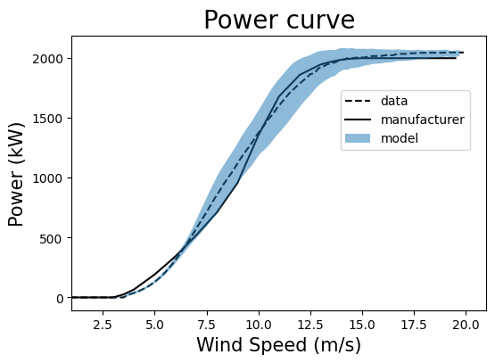

# WindTurbines_PINNs

This repository includes Python notebooks to build and train deep-learning models for prediction of the power generated by wind turbines, using data from 4 turbines at [‘La Haute Borne’ wind farm](https://opendata-renewables.engie.com/). The original dataset was pre-processed to remove non-physical and anomalous data points, and a reduced dataset with the interest variables $(v,\beta,\omega,T,P,C_p)$ is available at the `Dataset` directory. Pre-trained regression models for the power coefficient, mechanical torque and generated power can be found within the `Models` folder. The implementation and training of the models can be consulted at the `Scripts` directory, containing notebooks for standard artificial neural networks (NNs), physics-informed neural networks (PINNs) and neural networks with an evidential layer for uncertainty quantification.

While NN models learns only from data, PINNs are able to reproduce both data and some physical constraints, expressed by the equations: 
```math
P = gT\omega,
```
```math
P = \frac{1}{2}C_p\rho A v^3.
```
Indroducing an evidential output layer provided efficient and solid uncertainty quantification of the predictions, making possible the definition of confidence intervals in the power curve:



More details about the models can be found at the [arXiv preprint](https://arxiv.org/abs/2307.14675).
